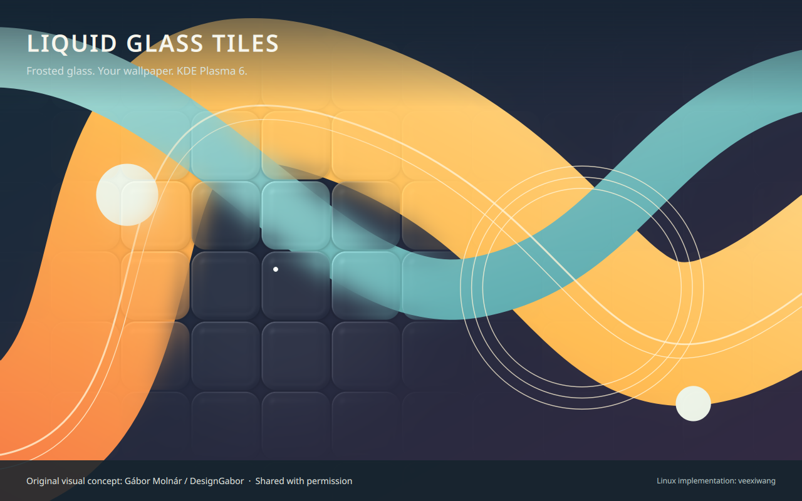

# Liquid Glass Tiles

A native **KDE Plasma 6 wallpaper plugin**. Rounded glass tiles reveal your wallpaper around the pointer, with frosted diffusion, curved-edge refraction and adjustable opacity. The pointer follows immediately by default.

**Original visual concept: [Gábor Molnár / DesignGabor](https://avely.me/designgabor).**
Shared with the original designer's permission. [X](https://x.com/DesignGabor) · [Original interactive design](https://my.spline.design/glassmorphcursortracking-2ef6d3790000fd1a4f81c92fb3ff5bf5/) · [Full credits](CREDITS.md)

[简体中文](README.zh-CN.md)



## Install

Download the **installation ZIP**, `liquid-glass-tiles-0.3.1.zip`, then run:

```sh
kpackagetool6 --type Plasma/Wallpaper --install liquid-glass-tiles-0.3.1.zip
```

Right-click the desktop → **Configure Desktop and Wallpaper** → choose **Liquid Glass Tiles** as the wallpaper type → Apply. It includes an original demo background; choose your own local image in settings.

Where the wallpaper settings offer **Get New Plugins → Install from File**, the same installation ZIP can be used. This package is a wallpaper plugin, not a desktop widget or Global Theme.

Runtime requirements: Plasma 6 and its Qt Quick / Kirigami components, with GPU shader support. No Python, Spline account, browser, background service, network access or system-package modification is needed to run the installed plugin.

## Slideshow

Enable Slideshow in wallpaper settings, add multiple local images, set the interval in seconds, then Apply. PNG, JPG/JPEG, WebP, BMP and SVG can be mixed when supported by Qt's image plugins. Selection order is used by default; random mode avoids immediately choosing the same entry. Remove individual entries or clear the list in settings.

Unreadable images are skipped. An empty list uses the single wallpaper (or bundled demo). If all entries fail, the last successfully displayed image is retained, or the single wallpaper/demo if none loaded; playback stops until settings change. Animated playback is not supported. Images crossfade over 0.5 seconds after the next image is ready.

The glass stays at the last desktop pointer position when the pointer moves over a panel or another window, and resumes tracking when it returns.

## Settings

| Setting | Effect |
| --- | --- |
| Glass opacity | 0 shows the original image; 100 shows the full effect near the pointer |
| Tile size | Size of the fixed rounded grid |
| Mouse radius | Area around the pointer where glass appears |
| Refraction strength | Bending at the curved glass edge |
| Frost strength | True two-pass Gaussian diffusion |
| Glass away from cursor | Residual glass outside the pointer area; 0 hides it |
| Follow delay | 0 gives immediate tracking; higher values add deliberate smoothing |
| Mouse interaction | Enable or disable pointer response |

Settings are available in English and Simplified Chinese. Use Language to follow the system or explicitly choose 简体中文 / English. Translations are bundled and work without a global locale installation. Original-designer credits and links are also included in the settings page.

## Update / uninstall

```sh
kpackagetool6 --type Plasma/Wallpaper --upgrade liquid-glass-tiles-0.3.1.zip
```

Plasma can retain loaded QML after a plugin update. If an update still behaves like the old version, log out and back in after saving your work.

To uninstall, first select a different wallpaper type, then run:

```sh
kpackagetool6 --type Plasma/Wallpaper --remove io.github.veexiwang.liquidglasstiles
```

The community package uses a separate ID from the development prototype `local.liquidglass`; it can be installed alongside it. It does not overwrite the prototype or migrate its settings automatically.

## Compatibility and limits

- Tested on Plasma **6.7.3**, Qt **6.11.1**, Wayland, Intel Arc B390 / Mesa **26.1.6** for the desktop pointer integration. The final material renderer was visually accepted in its standalone Qt **6.10.2** preview.
- Targets Plasma 6. Qt shader binaries are baked in the Qt 6.4-compatible container format; other Plasma / Qt versions and GPUs still need community testing.
- Tracks the pointer within the desktop window, including over the desktop's icon layer. It does not track through application windows or distort application contents.
- Multi-monitor, mixed-DPI, X11 and long-duration power consumption have not been certified.
- Cached blur avoids continuously recomputing blur while moving the pointer. A stationary isolated test generated no extra frames during a one-second observation; this is not a battery-life measurement.
- Only local images are accepted. The included background is original artwork distributed under the project license.

## Build and test

Build requirements: Python 3, Qt 6 Shader Tools (`qsb`) and gettext (`msgfmt`). Prebuilt shader files are included in the release ZIP.

```sh
python3 tools/build.py
python3 tools/check_package.py
```

The second command checks the actual installation archive and installs, upgrades and removes it inside a temporary package root, without changing your desktop.

Optional GPU regression tests and standalone preview need `uv` and PySide6:

```sh
QT_QPA_PLATFORM=offscreen QT_QUICK_BACKEND=rhi QSG_RHI_BACKEND=opengl \
  uv run --with PySide6==6.10.2 python tests/check.py --desktop-host
uv run --with PySide6==6.10.2 python tests/run.py
```

The offscreen OpenGL test still needs an available GL context (for example an X11/XWayland display); it is not a software-only headless test. Do not run the plugin with Qt Quick's software renderer: it does not implement these shader effects.

## License

Implementation and included original demo artwork: [MIT](LICENSE). The original Spline work is credited as design inspiration and is not included or relicensed. See [CREDITS.md](CREDITS.md).

After upgrading, save your work and log out and back in if new options are missing, settings do not persist, or old behavior remains. Closing the settings window alone may not reload cached QML, translations and configuration schemas. The plugin never restarts your desktop automatically.
